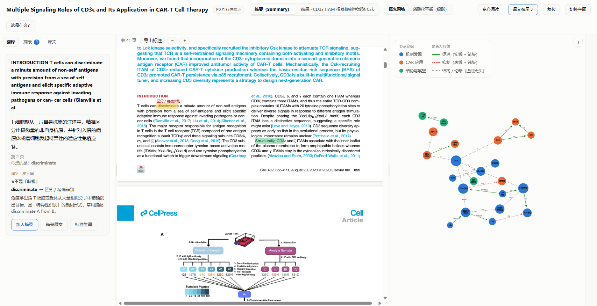
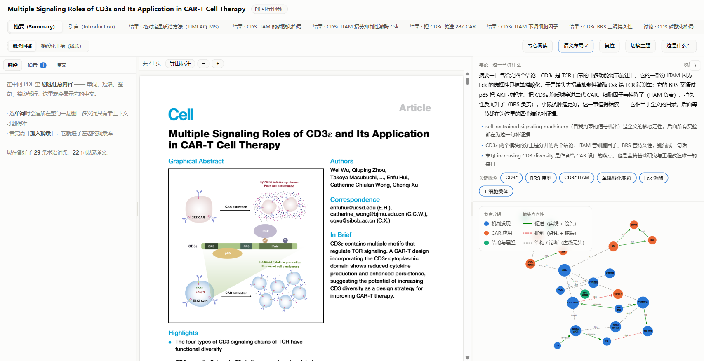
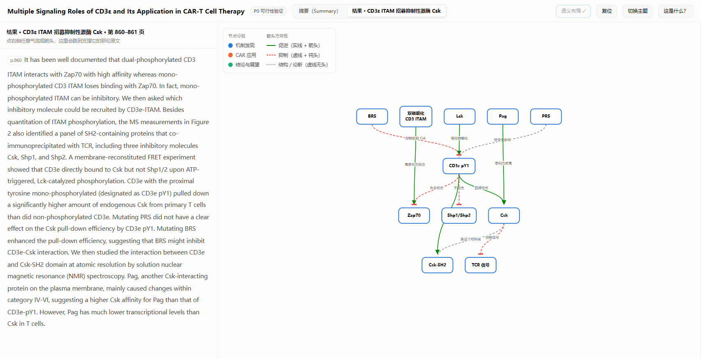
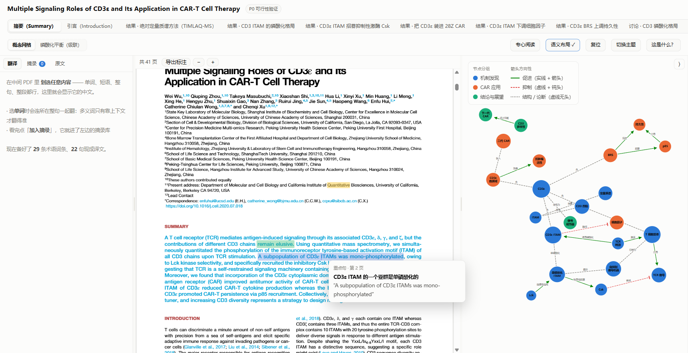
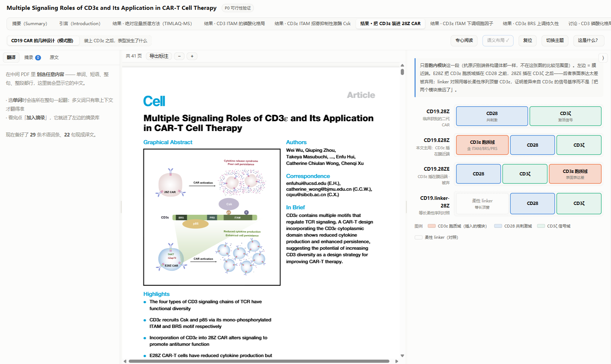
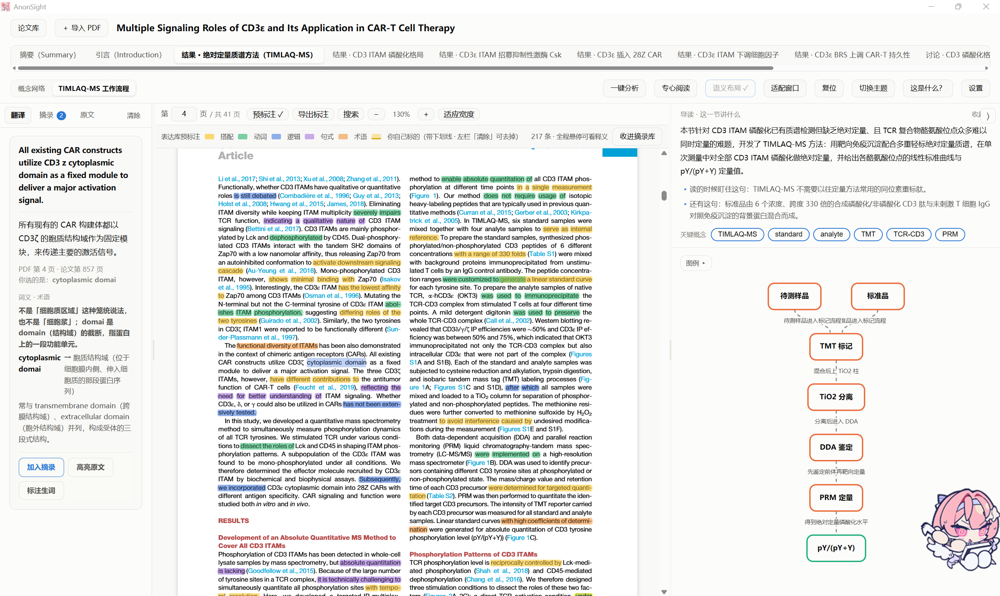
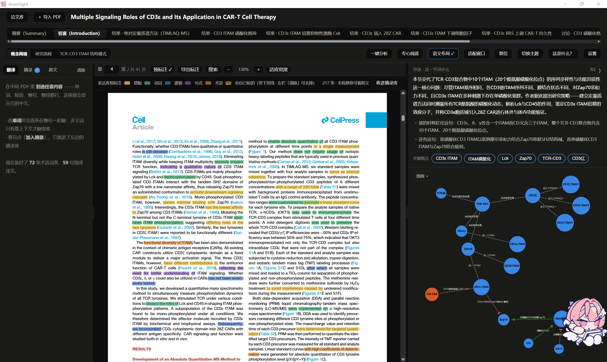
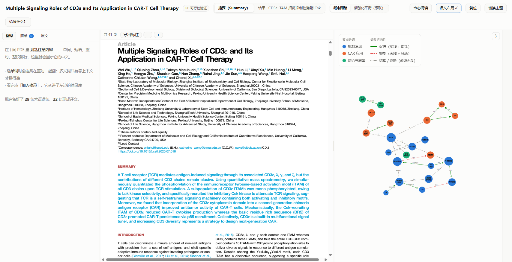

<div align="center">

# AnonSight

**把论文的思想结构，变成看得见的图**

读 PDF 的时候，右侧跟着你读到的位置，自动画出这一节的概念关系图——
每一个气泡、每一条箭头，都点得回原文那一句。

<p>
  &nbsp;
  &nbsp;
  &nbsp;
  
</p>

<p>
  <a href="#-这是什么">这是什么</a> •
  <a href="#-界面">界面</a> •
  <a href="#-快速开始">快速开始</a> •
  <a href="#-ai-接口现在支持什么">AI 接口</a> •
  <a href="#-参与贡献">参与贡献</a> •
  <a href="#-边界与已知问题">边界</a>
</p>



<sub>左：划词翻译与摘录 ｜ 中：真 PDF ｜ 右：跟着阅读位置走的思想图</sub>

</div>

---

## 🧭 这是什么

**AnonSight** 是一个本地运行的**论文精读工作台**。它不做「PDF 阅读器 + 翻译插件」的叠加，
而是回答一个更具体的问题：

> 读完一节，我能不能带走**这一节到底在讲什么**——而不是划了几处高亮。

所以它做完一篇论文后会产出两样东西：

- **一张思想图**（四种图型，按内容自动选）：概念网讲「有哪些东西」、流程图讲「怎么运转」、
  模式图讲「长什么样」、对照表讲「同类差在哪一格」
- **一份中文导读**：一句话说清这节讲什么，外加「读的时候盯住哪一句」

而**溯源是硬约束**：图上每个方框、每条箭头都挂着原文引文，
引文必须能在本节原文里**逐字找到**，否则这一节整节打回重做。
宁可少画，不许编造——把「促进」标成「抑制」比不标更糟。

---

## 🖼 界面

三栏 + 一列详情，**右栏跟着 PDF 位置走**：

<table>
<tr>
<td width="50%"><br>
<sub><b>导读 + 关键概念</b>：一句话说清这节讲什么，关键概念点开即概念卡</sub></td>
<td width="50%"><br>
<sub><b>点图回原文</b>：点任意方框或箭头，左栏跳到支撑它的那句原文并高亮</sub></td>
</tr>
<tr>
<td width="50%"><br>
<sub><b>悬停看释义</b>：全文自动标注五色高亮，鼠标一停出中文释义卡</sub></td>
<td width="50%"><br>
<sub><b>模式图</b>：构建体/结构域怎么搭的——气泡和方框都讲不清的那种内容</sub></td>
</tr>
<tr>
<td width="50%"><br>
<sub><b>流程图</b>：实验步骤、信号传递这类先后关系，方框加箭头画，条件写在箭头旁</sub></td>
<td width="50%"><br>
<sub><b>概念网</b>：概念之间的关系网（包含/结合/调控…），每个节点都能点回原文</sub></td>
</tr>
</table>



<sub><b>标注层</b>：AI 预标注是一层淡色，你自己标的是同色 + 底部实色下划线，在 PDF 里一眼看出是谁标的</sub>

---

## 🚀 快速开始

### 方式一：下载安装包（推荐，什么都不用装）

到 [**Releases**](../../releases) 下载 `AnonSight-0.1.0-Setup-preview.exe`，双击安装。
装完**不需要你电脑里有 Python**（解释器和全部依赖都打在包里了）、不用开浏览器，双击即用。

> ⚠️ 安装包**没有代码签名**，第一次装会被 Windows SmartScreen 拦成「未知发布者」。
> 点「更多信息 → 仍要运行」即可。

### 方式二：跑源码

```bash
git clone https://github.com/liebaojun/AnonSight.git
cd AnonSight
pip install -r requirements.txt
python server.py --port 8777     # 或双击 start.cmd（会自动装依赖）
```

然后打开 <http://127.0.0.1:8777/>。需要 Python 3.9 以上。

### 先别急着分析自己的论文——拿示范文件看效果

Releases 里附了一个**已经分析好的 `.ano` 示范文件**（`AnonSight-demo-Yue2026-Cell.ano`）。
拖进页面就能看到完整的分节、导读、思想图、标注层和译文，**不用配任何 AI、不花一分钱**。

> 觉得这套东西对你读文献有用，再去接自己的 AI 分析自己的论文。
> 先把效果看清楚，免得期望有落差。

**示范文件里的论文**：Yue et al., *Expansion and CAR engineering of granulocyte-monocyte
progenitors for cellular immunotherapy*, **Cell** 189, 1–18 (2026).
DOI: [10.1016/j.cell.2026.05.043](https://doi.org/10.1016/j.cell.2026.05.043) ——
该论文以 **CC BY 4.0** 许可开放获取，示范文件（含原文与平台生成的分析）按其条款分发并署名。

<sub>也就是说：这个 `.ano` 里装的东西 = 原文 + 12 节思想图（19 张图 / 162 个节点）+ 214 条标注 + 术语与整句译文。</sub>

---

## ✨ 它能做什么

- **导入与自动分节**：拖 PDF 进页面 → 自动认出编号标题/一级二级标题，剔掉正文碎片与图内文字
- **一键分析**：逐节产出导读 + 思想图 → 过校验器 → 生成标注层 → 预热翻译 → 打包成 `.ano`
- **划词翻译**：给的不是词典义项，是**这个词在这句话里的意思** + 易错提醒；整句译文预先算好缓存，划词秒回
- **全文自动标注**：五色高亮（搭配/动词/逻辑/句式/术语），悬停出中文释义
- **全局概念 ID**：点开一个气泡 = 这个概念在**全文每一处**的出处，点任意一条跳回原文
- **PDF 内部跳转**：正文里的 `[12]`、`Fig. 3` 点一下跳过去；拖一下是选词、点一下才跳，两者不打架
- **全文搜索** `Ctrl+F`：查某个基因名/术语出现在哪些页，命中画成琥珀金空心框
- **表达库**：划过的词句进摘录，一键整理成表达库格式（自动编号、自动判类型），可导出 JSON 带走
- **两种整屏状态**：专心阅读（收起右栏）· 适配窗口（窗口变过之后一键重排）

### `.ano`：一个文件装下一整篇精读项目

平台的存库格式 `.ano` **不是压缩包、不是数据库，而是一份合法 PDF**：

| 一个 `.ano` 里有什么 | 说明 |
|---|---|
| 原文 | 就是那篇论文本身，页面一个字节没改 |
| 思想图与导读 | 一键分析产出的节划分、导读卡、四种图型 |
| 标注与译文 | AI 预标注、你自己标的高亮、划词的翻译缓存 |

于是用**别的 PDF 阅读器打开照样能看**，**你自己打的高亮也在**（那是标准 PDF 注释）。
拷一个文件就走：发给别人、丢进网盘，图、标注、译文跟着走，不用带一个文件夹。

---

## 🤖 AI 接口：接哪家都行

平台的 AI 层是一个**通用的 OpenAI 兼容接口**——填三样东西就能用：

| 填什么 | 长什么样 |
|---|---|
| 接口地址 | `https://api.deepseek.com/v1` |
| 模型名 | `deepseek-flash` |
| API Key | 你自己在服务商那边申请的 |

顶栏「设置」→ 选一个「常用服务」（预置了 DeepSeek / Kimi / 智谱 GLM / OpenAI / 本地 Ollama），
**地址和模型名自动填好**，贴上 Key → 点「测试连接」当场验证通不通 → 点「保存」。

所以 **DeepSeek / Kimi / 智谱 / OpenAI / 本地 Ollama / 任何 OpenAI 兼容的服务**都能接，
包括你自己在局域网里跑的那些（那种连 Key 都不用填）。

### 两条路

| 适配器 | 说明 |
|---|---|
| `openai`（**默认**） | 打任意 OpenAI 兼容的 `/chat/completions`，**只要地址 + 模型名 + Key** |
| `claude-code` | 后台拉起本机的 `claude` 命令，给想用本机 CC 额度的人 |

换法：**推荐在设置界面里改**（有下拉和三个输入框）；也可以用配置文件 `paperide.config.json`
的 `adapter` / `ai` 字段，或环境变量 `PAPERIDE_ADAPTER`。

> 不接 AI 也能用：打开 `.ano`、看已有的章节分析、思想图、标注和译文都不受影响，
> 只是不能重跑分析、也不能对刚划的词做实时翻译。

### 欢迎加适配器（**是「增加」，不是「替换」**）

其他 agent 或模型服务的用户（Codex / DSH / Cursor / 自建服务 / 别的什么都行）非常欢迎来加一条路：

- `core/adapters.py` 里的 `ADAPTERS` **本来就是注册表**——加一个类 + 一行注册即可；
  只是想加一家 OpenAI 兼容的服务，连代码都不用改（设置里直接填地址）
- 请**保留现有的两条**，做成并列关系而不是替换——不然已经配好的人会突然用不了
- 一个适配器只需要干三件事：把 prompt 喂进去 → 把 JSON 抠出来 → 交给校验器

---

## 🤝 参与贡献

**最需要的一类贡献：让它在生物医学之外也能用。**

诚实说明：这个平台在开发和测试过程中，**绝大多数样本都是生物医学论文**（CAR-T、信号通路方向）。
它的骨架（分节、溯源校验、图型渲染、`.ano` 格式）是通用的，但**提示词和"什么内容用什么图"的规则
是照着生物医学的行文习惯调的**——换到其他学科，效果大概率会打折。

所以非常欢迎其他领域的同学来优化：

| 想改什么 | 改哪里 | 成本 |
|---|---|---|
| **领域提示词**（换学科的抽取规则/术语规范） | `prompts/*.md` 三个文件 | 小 |
| **AI 后端**（加 Codex / DSH / 本地模型） | `core/adapters.py` | 小 |
| **新的图型**（统计图、折线图、时序图、化学结构式……） | 前端渲染层——目前是写死的 if/else 分发，**这是最大的一块硬骨头** | 大 |
| **界面语言**（英文界面） | `P0/index.html`、`P0/library.html` | 中 |

> 插件化的口子已经留好了（`prompts/` 是纯文件、`adapters.py` 是注册表、图型分发是"一个函数 + 一行"），
> 但**还没有正式的插件加载机制**——现在是改源码。这是有意为之：先有真人写过插件，再谈分发方式。

其它欢迎的东西：bug 报告（带复现步骤最好）、扫描版 PDF 的适配、
非 Windows 平台的支持、以及**任何一篇"这个平台读起来不对劲"的论文样本**。

提 PR 之前请跑一下：

```bash
python tools/smoke_test.py            # 服务层冒烟（秒级）
python tools/regress_analyze.py       # 分析流水线回归（不花钱，用已有数据）
```

---

## ⚠️ 边界与已知问题

这是一个**能用但远不是成品**的项目。已知的坑都写在这儿，不藏着：

| 边界 | 现状 |
|---|---|
| **测试样本偏科** | 绝大多数是生物医学论文；其他学科的效果没有系统验证过（见上一节） |
| **各家模型的效果差异** | 接口是通用的，但**不同模型抽出来的图好不好没有系统验证过**（作者主要用 DeepSeek 系） |
| 超长一节出图数量 | 模型单次回话有输出上限，最长的节稳定出到 5 张；要更多得改多次调用 |
| 扫描版 PDF | 需要文字层，**纯扫描件没验证过** |
| 跨文献对比 | 概念 ID 已经是全局的、留了口子，但跨论文连图**还没做** |
| 某些版式的分节偏粗 | 有小标题但不是规范编号标题的版式（如 eLife 那类）切得偏粗 |
| 摘录的存放 | 摘录仍只存在浏览器本地（可导出 JSON）；**高亮标注已双写进 `.ano`** |
| 安装包无签名 | 会被 SmartScreen 拦，点「更多信息 → 仍要运行」 |
| 界面语言 | 中文界面，面向中文读者读英文文献 |

---

## 🛠 技术栈

- **后端**：Python，**只用标准库 + 三个包**（PyMuPDF / numpy / scikit-learn）——
  刻意压到最低，就是为了"克隆下来就能跑"
- **前端**：原生 JS，无框架无构建步骤；d3（图形）+ pdf.js（PDF 渲染）+ anime.js（动效）本地化内联
- **概念布局**：TF-IDF 向量化 + SVD 降维 + MDS 投影到 2D，让语义近的概念自动抱团
- **打包**：PyInstaller（onedir）+ Inno Setup，全部脚本在 `packaging/`

```
AnonSight/
├── server.py            本地 HTTP 服务 + 论文库管理
├── core/                后端内核
│   ├── adapters.py        ★ AI 适配器层（想加 agent 就改这里）
│   ├── pipeline_ai.py     一键分析流水线
│   ├── sectioner.py       自动分节
│   ├── locate.py          坐标反查与标注定位
│   ├── layout.py          语义向量布局
│   ├── ano_pack.py        .ano 打包/解包
│   └── ...
├── prompts/             ★ AI 提示词（想换学科就改这里）
│   ├── extract.md         抽取规则 + "什么内容用什么图"
│   ├── annotate.md        标注生成
│   └── translate.md       翻译
├── P0/                  前端（index.html 为阅读器，library.html 为论文库）
├── packaging/           打包与安装器
└── tools/               开发与回归脚本
```

---

## 🙏 相关项目

- **[MakoCode](https://github.com/liebaojun/MakoCode)** —— 同一作者做的桌面 AI Agent，
  自带完整 Galgame 界面。（跟本平台的 AI 没有依赖关系，只是同一个作者。）
- **Claude Code** ——*可选*的一条适配器：本机装过 CC 的人可以走它，不装也完全不影响使用。
- **pdf.js / d3 / anime.js** —— 前端三件套，均已本地化。

## 📄 License

[MIT](LICENSE) © 2026 liebaojun (猎豹君)

---

<div align="center">
<sub>

**English**: AnonSight is a local-first reading workbench for research papers.
It turns the *conceptual structure* of a paper into diagrams that track your reading position —
every node and edge links back to the exact sentence it came from, and the extraction is
gated by a verifier that rejects any claim not verbatim present in the source text.
Papers are stored in `.ano`, a format that *is* a valid PDF, so it opens in any reader.
Currently tested mostly on biomedical papers; contributions for other domains are very welcome.

</sub>
</div>
